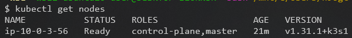
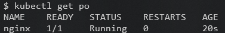

# k3s deployment

```console
alias tf=terraform
```
## download terraform dependencies
```console
cd terraform/project
tf init -backend-config=$(git rev-parse --show-toplevel)/terraform/remote_state_common.tfbackend -backend-config=remote_state.tfbackend
```

## create credentilas file with aws credentials (terraform/credentials)

## create cloud resources
```console
tf plan -out tfplan
tf apply tfplan
```

## save k3s instance private ip & bastion host public ip to env vars
```console
export K3S_INSTANCE_PRIVATE_IP=$(tf output -raw k3s_vm_private_ip)
export BASTION_HOST_PUBLIC_IP=$(tf output -raw bation_host_public_ip)
```

## ssh into k3s instance through bastion host
```console
ssh -J ubuntu@${BASTION_HOST_PUBLIC_IP} ubuntu@${K3S_INSTANCE_PRIVATE_IP} -i ~/.ssh/private_key
```
## view /etc/rancher/k3s/k3s.yaml content (on k3s instance)
```console
sudo cat /etc/rancher/k3s/k3s.yaml
```

## on local machine create kubeconfig file ~/.kube/config_k3s_aws with content from /etc/rancher/k3s/k3s.yaml file on k3s instance

## save path to kubeconfig to env var
```console
export KUBECONFIG=~/.kube/config_k3s_aws
```

## establish ssh tunnel to bastion host
```console
ssh -L "127.0.0.1:6443:${K3S_INSTANCE_PRIVATE_IP}:6443" ubuntu@${BASTION_HOST_PUBLIC_IP} -i ~/.ssh/private_key
```

## on local machine run kubectl command to view k3s nodes
```console
kubectl get nodes
```


## deploy example pod
```console
kubectl apply -f https://k8s.io/examples/pods/simple-pod.yaml
```

## check that example pod is running
```console
kubectl get po
```



## destroy resources
```console
tf destroy
```
