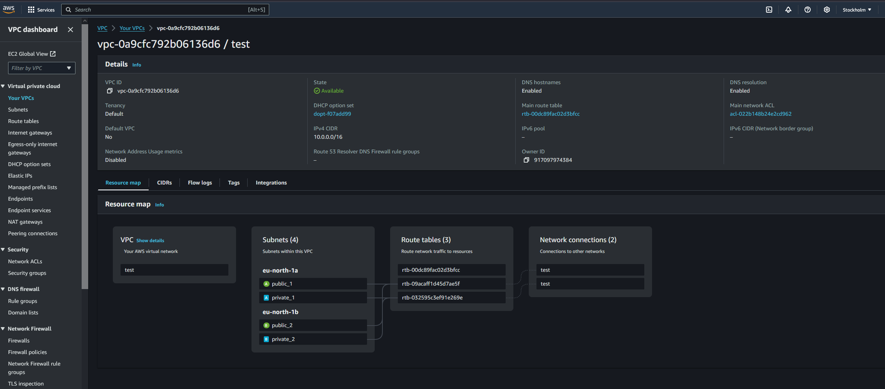

# vpc resource map



```console
alias tf=terraform
```
## download terraform dependencies
```console
cd terraform/project
tf init -backend-config=$(git rev-parse --show-toplevel)/terraform/remote_state_common.tfbackend -backend-config=remote_state.tfbackend
```

## create credentilas file with aws credentials (terraform/credentials)

## create cloud resources
```console
tf plan -out tfplan
tf apply tfplan
```

## destroy resources
```console
tf destroy
```
